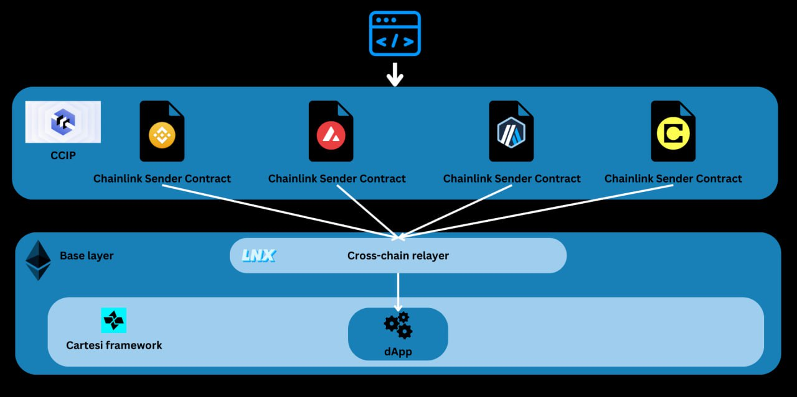
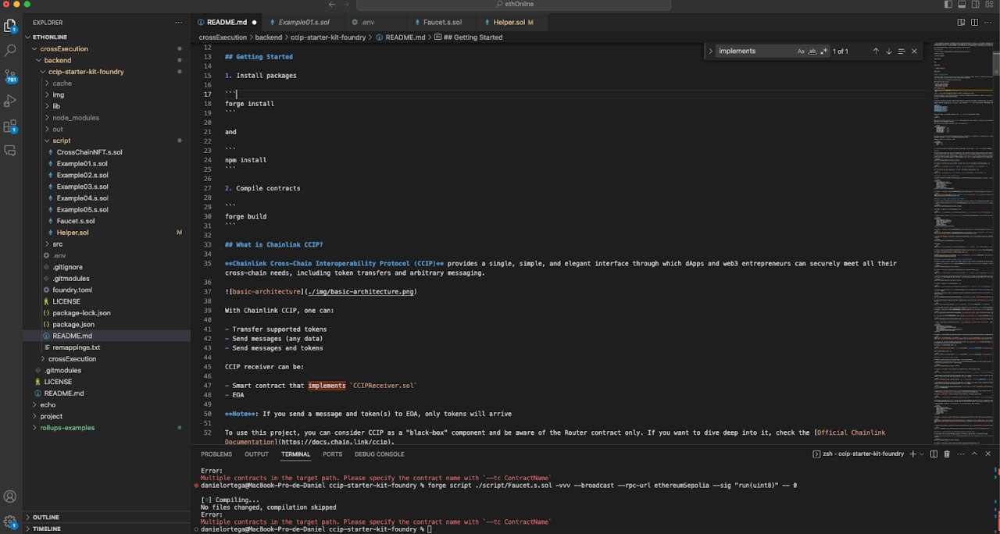
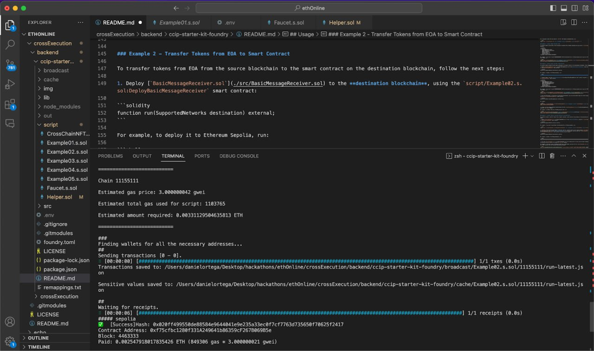
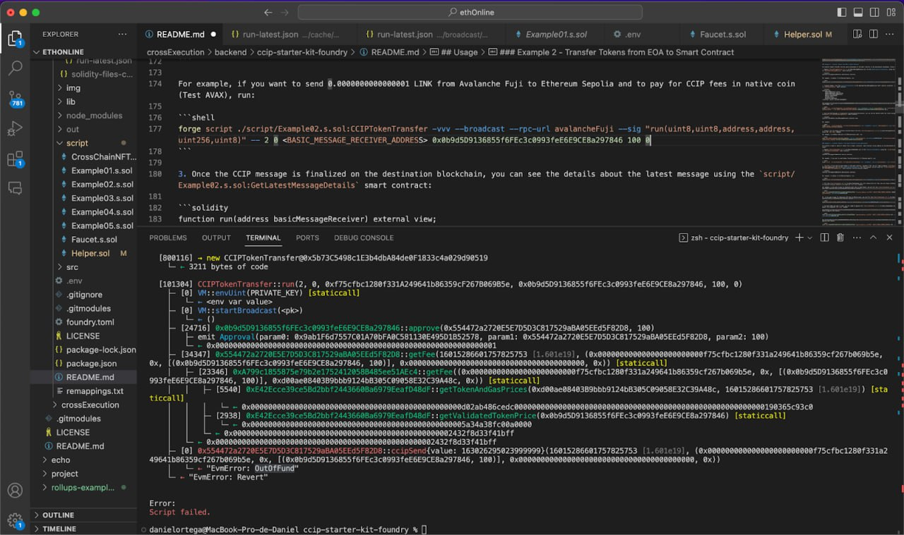
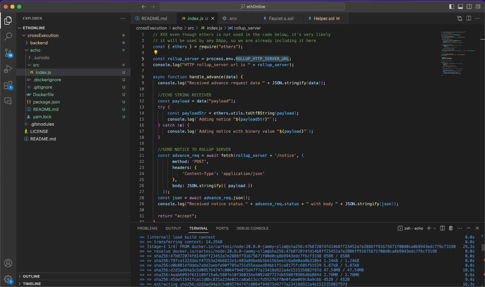
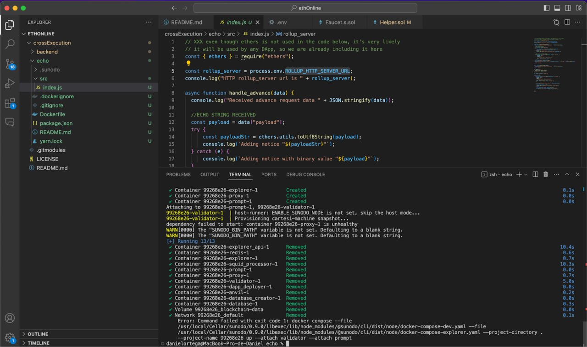
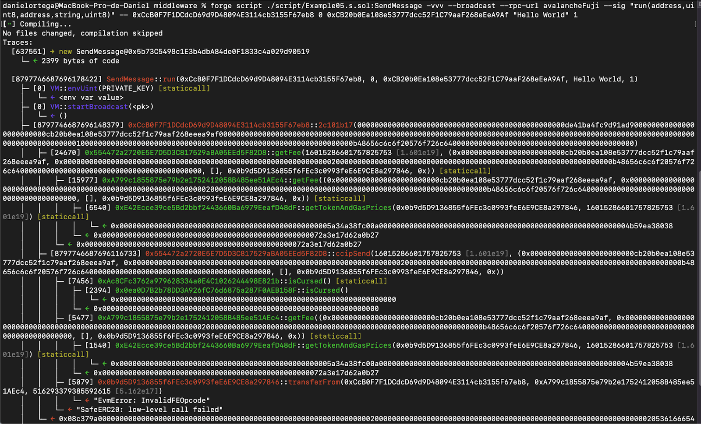

# What is LNX

LNX is an innovative project that introduces a groundbreaking solution for deploying [Cartesi-powered](https://cartesi.io/) Linux  decentralized applications (dApps) across all the blockchain ecosystem. This project enables cross-chain communication, allowing computer-demanding dApps to seamlessly function on different blockchains.

LNX's uniqueness is in the ability to deploy Cartesi dApps cross-chaing by leveraging the power of the newly released Chainlink CCIP protocol.

LNX was Developed during ETHGLobal Online Hackathon. To prove in-detailed understanding of LNX, in parallel with the development, we created a dedicated [Documentation portal](https://lnx.surge.sh/).


## High-level architecture

LNX harnesses the robust capabilities of [Cartesi](https://cartesi.io/), a versatile app-specific scaling solution, to enable Linux runtime dApps across different blockchains, taking interoperability to a new level. 



User inputs to a Cartesi dApp come through Message Sender Smart Contracts dedicated to each network and running in CCIP. The inpouts are then transferred to LNX's cross-chain relayer that is running on the base layer and further sent to a Cartesi dApp.

## Advantages

* **Blockchain Agnosticism**: LNX provides blockchain agnosticism, allowing developers to choose from a range of blockchains for dApp deployment. This flexibility reduces the risk associated with blockchain-specific challenges and limitations.

* **Scalability and Portability**: The LNX infrastructure solution enhances dApp scalability by offering the flexibility to deploy on different blockchains. Developers can select the blockchain that best suits their scalability needs, with the added benefit of the option to migrate should their requirements change, ensuring an unmatched level of portability.

* **Interoperability**: Cross-chain communication facilitates innovative cross-chain functionality, such as decentralized exchanges operating across multiple blockchains, harnessing the strengths of each network.

* **Diverse User Bases**: Accessing multiple blockchains allows developers to tap into a broader range of user communities and ecosystems, fostering credibility, community growth, market expansion, and increasing the potential for widespread adoption.

* **Decentralization and Security**: LNX maintains core blockchain principles, ensuring security and decentralization across multiple networks.

* **Risk Mitigation**: The ability to deploy on various blockchains reduces dependence on a single network, thereby mitigating risks associated with technical, operational, and governance issues, as well as concerns related to limited user base, low adoption rates, development constraints of the underlying chain, or regulatory alterations.

## Development process


### Creating a basic Ethereum dApp

As the first step of LNX development, we create a simple Ethereum dApp that receives messages from [Avalanche](https://www.avax.network/) and implements [CCIP from Chainlink](https://chain.link/cross-chain).

1. Clone [CCIP Starter kit repository](https://github.com/smartcontractkit/ccip-starter-kit-foundry).



2. Install packages:

```shell
forge install
npm install
```
3. Compile contracts:

```shell
forge build
```


4. Use infura RPC endpoint to have access to different blockchains.
3. Deploy the smart contract to Ethereum Sepolia.



Here we see the deployment of the Relayer in Ethereum. In the example below, we do not have enough funds in Avalance to send to Ethereum:




### Deploying a Cartesi dApp 

#### Initial build with Sunodo

We first deployed an example Cartesi dApp called [Echo Python](https://docs.cartesi.io/cartesi-rollups/0.8/build-dapps/run-dapp/) by using Cartesi's [Sunodo framework](https://docs.sunodo.io/). 






After building the initial locally working  application, we’re going to use [rollups-examples](https://github.com/cartesi/rollups-examples) and clone the Echo dApp from there.

#### Building an echo dApp from Cartesi Rollups examples

1. Clone the [cartesi/rollups-examples](https://github.com/cartesi/rollups-examples) Github repository, and `cd` into it:

```shell
git clone https://github.com/cartesi/rollups-examples.git
cd rollups-examples
```

2. Navigate to the dApp example directory by running the following command:

```shell
cd echo-python
```

3. Build the Echo DApp:
```shell
docker buildx bake --load
```


#### Running the Cartesi dApp


To run the application, we start an environment that includes a local blockchain with the Cartesi smart contracts deployed, as well as a Cartesi layer-2 node executing the DApp's back-end logic.


```shell
docker compose -f ../docker-compose.yml -f ./docker-compose.override.yml up
```


#### Frontend-console application

With the infrastructure in place, we can use the [frontend-console application](https://github.com/cartesi/rollups-examples/tree/main/frontend-console) to interact with the Echo dApp.

Every Rollups dApp gets an address on the base layer when it's deployed. The following is needed to send inputs to a DApp:

* Gateway URL to the intended chain
* Cartesi Rollups InputBox contract address
* Appropriate account with sufficient funds for submitting transactions to the network

#### Interacting with the dApp locally 

The following steps describe how to send an input to the Echo DApp instance that is running locally:

1. Open a separate terminal window
2. From the rollups-examples base directory, navigate to the `frontend-console` one:

```shell
cd frontend-console
```

3. Build the frontend console application:

```shell
yarn
yarn build
```

4. Send an input to the current locally deployed DApp:

```shell
yarn start input send --payload "hi there!"
```


5. Verify the outputs (notices) generated by your input:

```shell
yarn start notice list
```

After completing all the steps above, we get a response with the payload of the notice:

`"hi there!"`


#### Deploying the dApp to Sepolia

1. We run:

```shell
DAPP_NAME=echo-dlinn docker compose --env-file ../env.sepolia -f ../deploy-testnet.yml up
```


2. We then run the validator node.


3. Once the validator node is running, we interact with it via the Front-end console.


#### Interacting with the dApp to Sepolia

1. To interact with the dApp on Sepolia, we need to adjust the Front-end console by switching `localhost` to `sepolia` in the `.env` files.

:::note
We may need to deploy custom graphql for querying information. We try to add input information without crosschain, frontend -> Cartesi dAPP and see if information is queried.
:::

2. Now we can send an input as follows:

```shell
yarn start input send --payload "test 1946" --rpc https://sepolia.infura.io/v3/417f9a026f74429d99b34ab38a96b676 --dapp echo-dlinn
```


###  Deploying a contract for CCIP and Cartesi dApp

We deploy an Ethereum Smart Contract that implements `CCIPReceiver.sol` interface and forwards information to the Cartesi Echo dApp.

#### First deployment

In our first deployment, we used the following data:

* Sepolia InputBox
* Sepolia Relayer
* Avax Sender
* Wss for validator
* RPC endpoint

We get an error that might appaer because we don’t have enough balance in Avax sender, or in Sepolia relayer. To solve this, we add funds with avax sender (.1 AVAX) and send the transaction paid with the native coin, not LINK.



#### Second deployment

In our second deployment we use:

* Relayer deployed at:

```shell
0xc690DBb7c8BaeEE9039a2F7c1fb1E881bdcF738C
0x0f34DD596F2EdA21e2cEa551c80e31178ee62Bd0
0x543827f99405cCAf09Bd8993e1f47d6382C0747e
0xD0a5Aa8D099B9B6F5Ac619c9aC363443DFfF13e3
0x501acCDbC057338E5A75aA4b4BaB795830D232de
```

* New deploy command:

```shell
forge script ./script/DeployCrosschainrelayer.s.sol:DeployCrossChainRelayer -vvv --broadcast --rpc-url ethereumSepolia --sig "run(uint8, address, address)" -- 0 0x59b22D57D4f067708AB0c00552767405926dc768 0xe2510c5470FEDD84e6FbFF29c647B0c883dBc496

0x98fcf378FdB37a9615014E91772EF9d921697ED2
```

* Sender deployed at:

```shell
0xCcB0F7F1DCdcD69d9D48094E3114cb3155F67eb8
0x6D1105f424dC488DB39A151CF78bd3296a786b95
0x2F89874C7CdD48DFC56F48a21E255a66804E85Eb
```

* Sending an input:

```shell
cast send 0xCcB0F7F1DCdcD69d9D48094E3114cb3155F67eb8 --rpc-url avalancheFuji --private-key=<> --value 0.1ether
```

```shell
cast send 0x0b9d5D9136855f6FEc3c0993feE6E9CE8a297846 "transfer(address,uint256)" 0xCcB0F7F1DCdcD69d9D48094E3114cb3155F67eb8 10000000000000000 --rpc-url avalancheFuji --private-key=<>
```


## Building dApps with LNX


1. Run a validator node.

For example, for Sepolia:

```shell
export WSS_URL=wss://sepolia.infura.io/ws/v3/<<YOUR-KEY>>
```

Cartesi Server Manager must be built specifying the network used:

```shell
docker buildx bake server --load --set “*.args.NETWORK=sepolia”
```


2. Export the RPC URL.

For example, for Sepolia:


```shell
export RPC_URL=https://sepolia.infura.io/v3/<<YOUR-KEY>>
```

```shell
export mnemonic=””
```

3. Run the node.

For example, for Sepolia:


```shell
DAPP_NAME=echo-dlinn docker compose --env-file ../env.sepolia -f ../docker-compose-testnet.yml -f ./docker-compose.override.yml up
```

4. Send an input from the frontend console:

```shell
yarn start input send --payload "test 1946" --rpc https://sepolia.infura.io/v3/<<YOUR-KEY>> --dapp echo-dlinn
```

## Summary

In summary, LNX, the Cross-Chain Cartesi-Powered Linux Runtime Rollup, offers dApp developers a versatile and adaptable solution for blockchain deployment. With the flexibility to operate on multiple blockchains, it enables developers to create versatile applications, achieve horizontal scalability, expand their user base, access greater liquidity, and navigate the ever-evolving blockchain landscape with confidence and ease, without being perpetually tied to their initial choice of base layer.
