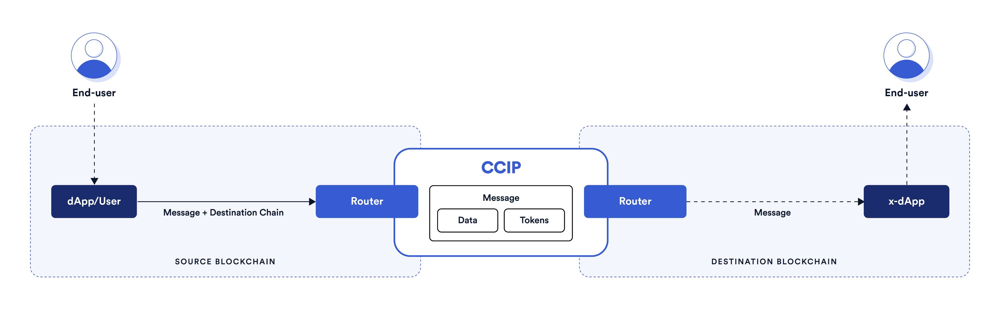

## Chainlink CCIP Starter Kit

> **Note**
>
> _This repository represents an example of using a Chainlink product or service. It is provided to help you understand how to interact with Chainlink’s systems so that you can integrate them into your own. This template is provided "AS IS" without warranties of any kind, has not been audited, and may be missing key checks or error handling to make the usage of the product more clear. Take everything in this repository as an example and not something to be copy pasted into a production ready service._

This project demonstrates a couple of basic Chainlink CCIP use cases.

## Prerequisites

- [Foundry](https://book.getfoundry.sh/getting-started/installation)

## Getting Started

1. Install packages

```
forge install
```

and

```
npm install
```

2. Compile contracts

```
forge build
```

## What is Chainlink CCIP?

**Chainlink Cross-Chain Interoperability Protocol (CCIP)** provides a single, simple, and elegant interface through which dApps and web3 entrepreneurs can securely meet all their cross-chain needs, including token transfers and arbitrary messaging.



With Chainlink CCIP, one can:

- Transfer supported tokens
- Send messages (any data)
- Send messages and tokens

CCIP receiver can be:

- Smart contract that implements `CCIPReceiver.sol`
- EOA

npx hardhat ccip-token-transfer --source-blockchain ethereumSepolia --destination-blockchain avalancheFuji --receiver <RECEIVER_ADDRESS> --token-address 0x779877A7B0D9E8603169DdbD7836e478b4624789 --amount 100 --gas-limit 0 --fee-token-address 0x779877A7B0D9E8603169DdbD7836e478b4624789

**Note**: If you send a message and token(s) to EOA, only tokens will arrive

To use this project, you can consider CCIP as a "black-box" component and be aware of the Router contract only. If you want to dive deep into it, check the [Official Chainlink Documentation](https://docs.chain.link/ccip).

## Usage

In the next section you can see a couple of basic Chainlink CCIP use case examples. But before that, you need to set up some environment variables.

Create a new file by copying the `.env.example` file, and name it `.env`. Fill in your wallet's PRIVATE_KEY, and RPC URLs for at least two blockchains

```shell
PRIVATE_KEY=""
ETHEREUM_SEPOLIA_RPC_URL=""
OPTIMISM_GOERLI_RPC_URL=""
AVALANCHE_FUJI_RPC_URL=""
ARBITRUM_TESTNET_RPC_URL=""
POLYGON_MUMBAI_RPC_URL=""
```

Once that is done, to load the variables in the `.env` file, run the following command:

```shell
source .env
```

Make yourself familiar with the [`Helper.sol`](./script/Helper.sol) smart contract. It contains all the necessary Chainlink CCIP config. If you ever need to adjust any of those parameters, go to the Helper contract.

This contract also contains some enums, like `SupportedNetworks`:

```solidity
enum SupportedNetworks {
    ETHEREUM_SEPOLIA,   // 0
    OPTIMISM_GOERLI,    // 1
    AVALANCHE_FUJI,     // 2
    ARBITRUM_GOERLI,    // 3
    POLYGON_MUMBAI      // 4
}
```

This means that if you want to perform some action from `AVALANCHE_FUJI` blockchain to `ETHEREUM_SEPOLIA` blockchain, for example, you will need to pass `2 (uint8)` as a source blockchain flag and `0 (uint8)` as a destination blockchain flag.

Similarly, there is an `PayFeesIn` enum:

```solidity
enum PayFeesIn {
    Native,  // 0
    LINK     // 1
}
```

So, if you want to pay for Chainlink CCIP fees in LINK token, you will pass `1 (uint8)` as a function argument.

### Faucet

You will need test tokens for some of the examples in this Starter Kit. Public faucets sometimes limit how many tokens a user can create and token pools might not have enough liquidity. To resolve these issues, CCIP supports two test tokens that you can mint permissionlessly so you don't run out of tokens while testing different scenarios.

To get 10\*\*18 units of each of these tokens, use the `script/Faucet.s.sol` smart contract. Keep in mind that the `CCIP-BnM` test token you can mint on all testnets, while `CCIP-LnM` you can mint only on Ethereum Sepolia. On other testnets, the `CCIP-LnM` token representation is a wrapped/synthetic asset called `clCCIP-LnM`.

```solidity
function run(SupportedNetworks network) external;
```

For example, to mint 10\*\*18 units of both `CCIP-BnM` and `CCIP-LnM` test tokens on Ethereum Sepolia, run:

```shell
forge script ./script/Faucet.s.sol -vvv --broadcast --rpc-url ethereumSepolia --sig "run(uint8)" -- 0
```

Or if you want to mint 10\*\*18 units of `CCIP-BnM` test token on Avalanche Fuji, run:

```shell
forge script ./script/Faucet.s.sol -vvv --broadcast --rpc-url avalancheFuji --sig "run(uint8)" -- 2
```
### STEPS TO REPRODUCE ONCE EVERYTHING DEPLOYED
1. We can send messages from Fuji to Sepolia, and relayer will forward to cartesi dApp

`forge script ./script/Example05.s.sol:SendMessage -vvv --broadcast --rpc-url avalancheFuji --sig "run(address,uint8,address,string,uint8)" -- <BASIC_MESSAGE_SENDER_ADDRESS> 0 <BASIC_MESSAGE_RECEIVER_ADDRESS> "Message from origin at 12:43" 1`.

2. If the sender contract does not have enough funds:
`cast send 0x0b9d5D9136855f6FEc3c0993feE6E9CE8a297846 "transfer(address,uint256)"  <SENDER> 300000000000000000 --rpc-url avalancheFuji --private-key=<>                                      `
Putting your private key.


3. OFFICIAL ADDRESSES:
`Relayer: 0x98fcf378FdB37a9615014E91772EF9d921697ED2`
`BasicMessage Sender: 0x78966DeFeC946e78BF9E2A7f93b5f443ADbD36eE`

WARNING
X. Change docker compose testnet yml with your mnemonic if you have problems with validator node.
      `AUTH_MNEMONIC: ${AUTH_MNEMONIC:?undefined AUTH_MNEMONIC}` to `AUTH_MNEMONIC: xxx xxx xxx `


### THIS IS THE FIRST STEP Example 6 - Send & Receive Cross-Chain Messages and Pay with LINK Tokens

To send simple Text Cross-Chain Messages and pay for CCIP fees in LINK Tokens, follow the next steps:

1. Deploy the [`BasicMessageSender.sol`](./src/BasicMessageSender.sol) smart contract on the **source blockchain**, using the `script/Example05.s.sol:DeployBasicMessageSender` smart contract:

```solidity
function run(SupportedNetworks source) external;
```

For example, if you want to send a simple cross-chain message from Avalanche Fuji, run:

```shell
forge script ./script/Example05.s.sol:DeployBasicMessageSender -vvv --broadcast --rpc-url avalancheFuji --sig "run(uint8)" -- 2
```

2. Fund the [`BasicMessageSender.sol`](./src/BasicMessageSender.sol) smart contract with Testnet LINKs, either manually using your wallet or by using the `cast send` command. For example, if you want to send 0.01 Fuji LINK, run:

```shell
cast send 0x0b9d5D9136855f6FEc3c0993feE6E9CE8a297846 "transfer(address,uint256)" <BASIC_MESSAGE_SENDER_ADDRESS> 10000000000000000 --rpc-url avalancheFuji --private-key=$PRIVATE_KEY
```

3. Deploy the [`CrossChainRelayer.sol`](./src/CrossChainRelayer.sol) smart contract to the **destination blockchain**. For this purpose, you can reuse the `script/DeployCrosschainrelayer.s.sol:DeployCrossChainRelayer` smart contract from the second example:

```solidity
function run(SupportedNetworks destination, address dappAddress) external;
```

For example, to deploy it to Ethereum Sepolia, run:

```shell
forge script ./script/DeployCrosschainrelayer.s.sol:DeployCrossChainRelayer -vvv --broadcast --rpc-url ethereumSepolia --sig "run(uint8, address)" -- 0 <DAPP_INPUTBOX>
```

4. Finally, send a cross-chain message using the `script/Example05.s.sol:SendMessage` smart contract:

```solidity
function run(
    address payable sender,
    SupportedNetworks destination,
    address receiver,
    string memory message,
    BasicMessageSender.PayFeesIn payFeesIn
) external;
```

For example, if you want to send a "Hello World" message type:

```shell
forge script ./script/Example05.s.sol:SendMessage -vvv --broadcast --rpc-url avalancheFuji --sig "run(address,uint8,address,string,uint8)" -- <BASIC_MESSAGE_SENDER_ADDRESS> 0 <BASIC_MESSAGE_RECEIVER_ADDRESS> "Hello World" 1
```

5. Once the CCIP message is finalized on the destination blockchain, you can see the details about the latest message using the `script/Example02.s.sol:GetLatestMessageDetails` smart contract:

```solidity
function run(address basicMessageReceiver) external view;
```

For example,

```shell
forge script ./script/Example02.s.sol:GetLatestMessageDetails -vvv --broadcast --rpc-url ethereumSepolia --sig "run(address)" -- <BASIC_MESSAGE_RECEIVER_ADDRESS>
```

6. You can always withdraw tokens for Chainlink CCIP fees from the [`BasicMessageSender.sol`](./src/BasicMessageSender.sol) smart contract using the `cast send` command:

```shell
cast send <BASIC_MESSAGE_SENDER_ADDRESS> --rpc-url avalancheFuji --private-key=$PRIVATE_KEY "withdrawToken(address,address)" <BENEFICIARY_ADDRESS> 0x0b9d5D9136855f6FEc3c0993feE6E9CE8a297846
```


### THIS IS THE TEMPLATE Example 6 - Send & Receive Cross-Chain Messages and Pay with LINK Tokens

To send simple Text Cross-Chain Messages and pay for CCIP fees in LINK Tokens, follow the next steps:

1. Deploy the [`BasicMessageSender.sol`](./src/BasicMessageSender.sol) smart contract on the **source blockchain**, using the `script/Example05.s.sol:DeployBasicMessageSender` smart contract:

```solidity
function run(SupportedNetworks source) external;
```

For example, if you want to send a simple cross-chain message from Avalanche Fuji, run:

```shell
forge script ./script/Example05.s.sol:DeployBasicMessageSender -vvv --broadcast --rpc-url avalancheFuji --sig "run(uint8)" -- 2
```

2. Fund the [`BasicMessageSender.sol`](./src/BasicMessageSender.sol) smart contract with Testnet LINKs, either manually using your wallet or by using the `cast send` command. For example, if you want to send 0.01 Fuji LINK, run:

```shell
cast send 0x0b9d5D9136855f6FEc3c0993feE6E9CE8a297846 "transfer(address,uint256)" <BASIC_MESSAGE_SENDER_ADDRESS> 10000000000000000 --rpc-url avalancheFuji --private-key=$PRIVATE_KEY

cast send 0xCcB0F7F1DCdcD69d9D48094E3114cb3155F67eb8 --rpc-url avalancheFuji --private-key=<> --value 0.13ether
```

3. Deploy the [`BasicMessageReceiver.sol`](./src/BasicMessageReceiver.sol) smart contract to the **destination blockchain**. For this purpose, you can reuse the `script/Example02.s.sol:DeployBasicMessageReceiver` smart contract from the second example:

```solidity
function run(SupportedNetworks destination) external;
```

For example, to deploy it to Ethereum Sepolia, run:

```shell
forge script ./script/Example02.s.sol:DeployBasicMessageReceiver -vvv --broadcast --rpc-url ethereumSepolia --sig "run(uint8)" -- 0
```

4. Finally, send a cross-chain message using the `script/Example05.s.sol:SendMessage` smart contract:

```solidity
function run(
    address payable sender,
    SupportedNetworks destination,
    address receiver,
    string memory message,
    BasicMessageSender.PayFeesIn payFeesIn
) external;
```

For example, if you want to send a "Hello World" message type:

```shell
forge script ./script/Example05.s.sol:SendMessage -vvv --broadcast --rpc-url avalancheFuji --sig "ru
n(address,uint8,address,string,uint8)" -- <BASIC_MESSAGE_SENDER_ADDRESS> 0 <BASIC_MESSAGE_RECEIVER_ADDRESS> "Hello World"
1
```

5. Once the CCIP message is finalized on the destination blockchain, you can see the details about the latest message using the `script/Example02.s.sol:GetLatestMessageDetails` smart contract:

```solidity
function run(address basicMessageReceiver) external view;
```

For example,

```shell
forge script ./script/Example02.s.sol:GetLatestMessageDetails -vvv --broadcast --rpc-url ethereumSepolia --sig "run(address)" -- <BASIC_MESSAGE_RECEIVER_ADDRESS>
```

6. You can always withdraw tokens for Chainlink CCIP fees from the [`BasicMessageSender.sol`](./src/BasicMessageSender.sol) smart contract using the `cast send` command:

```shell
cast send <BASIC_MESSAGE_SENDER_ADDRESS> --rpc-url avalancheFuji --private-key=$PRIVATE_KEY "withdrawToken(address,address)" <BENEFICIARY_ADDRESS> 0x0b9d5D9136855f6FEc3c0993feE6E9CE8a297846
```
cast send 0xdc2CC710e42857672E7907CF474a69B63B93089f "transfer(address,uint256)"  0xCcB0F7F1DCdcD69d9D48094E3114cb3155F67eb8 400000000000000000 --rpc-url optimismGoerli --private-key=

cast send 0xd14838A68E8AFBAdE5efb411d5871ea0011AFd28 "transfer(address,uint256)"  0xCcB0F7F1DCdcD69d9D48094E3114cb3155F67eb8 400000000000000000 --rpc-url arbitrumTestnet --private-key=

cast send 0x326C977E6efc84E512bB9C30f76E30c160eD06FB "transfer(address,uint256)"  0xCcB0F7F1DCdcD69d9D48094E3114cb3155F67eb8 400000000000000000 --rpc-url polygonMumbai --private-key=

cast send 0x84b9B910527Ad5C03A9Ca831909E21e236EA7b06 "transfer(address,uint256)"  0xCB20b0Ea108e53777dcc52F1C79aaF268eEeA9Af 400000000000000000 --rpc-url bscTestnet --private-key=

/*FOR BASE DO IT IN METAMASK*/

forge script ./script/Example05.s.sol:SendMessage -vvv --broadcast --rpc-url optimismGoerli --sig "run(address,uint8,address,string,uint8)" -- 0xCcB0F7F1DCdcD69d9D48094E3114cb3155F67eb8 0 0x98fcf378FdB37a9615014E91772EF9d921697ED2 "Message from Optimism at 12:43" 1

forge script ./script/Example05.s.sol:SendMessage -vvv --broadcast --rpc-url arbitrumTestnet --sig "run(address,uint8,address,string,uint8)" -- 0xCcB0F7F1DCdcD69d9D48094E3114cb3155F67eb8 0 0x98fcf378FdB37a9615014E91772EF9d921697ED2 "Message from Arbitrum at 09:22" 1

forge script ./script/Example05.s.sol:SendMessage -vvv --broadcast --rpc-url polygonMumbai --sig "run(address,uint8,address,string,uint8)" -- 0xCcB0F7F1DCdcD69d9D48094E3114cb3155F67eb8 0 0x98fcf378FdB37a9615014E91772EF9d921697ED2 "Message from Polygon at 09:31" 1

forge script ./script/Example05.s.sol:SendMessage -vvv --broadcast --rpc-url bscTestnet --sig "run(address,uint8,address,string,uint8)" -- 0xCB20b0Ea108e53777dcc52F1C79aaF268eEeA9Af 0 0x98fcf378FdB37a9615014E91772EF9d921697ED2 "Message from BSC at 09:36" 1

forge script ./script/Example05.s.sol:SendMessage -vvv --broadcast --rpc-url baseGoerli --sig "run(address,uint8,address,string,uint8)" -- 0xCcB0F7F1DCdcD69d9D48094E3114cb3155F67eb8 0 0x98fcf378FdB37a9615014E91772EF9d921697ED2 "Message from Base at 09:44" 1

